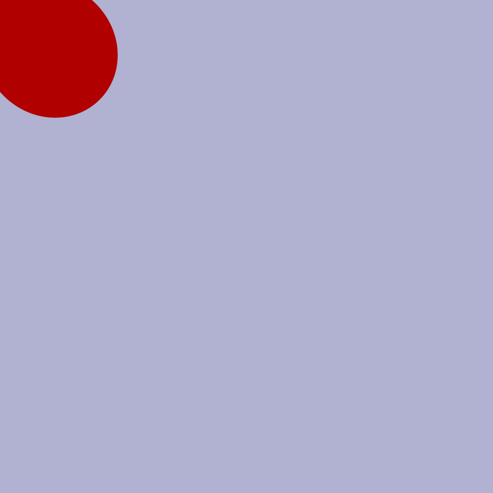
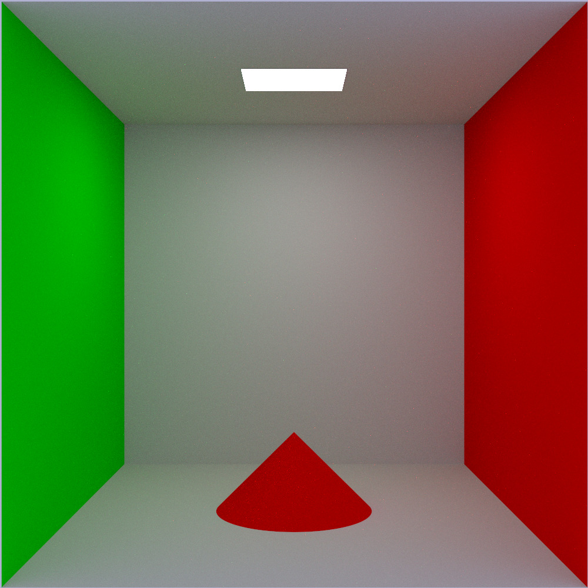
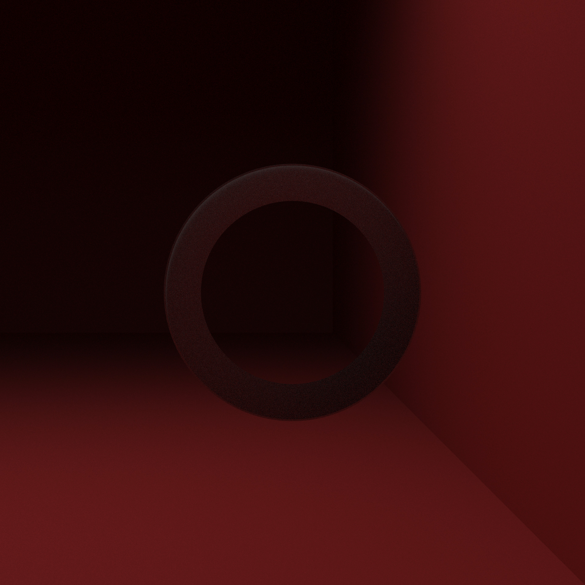
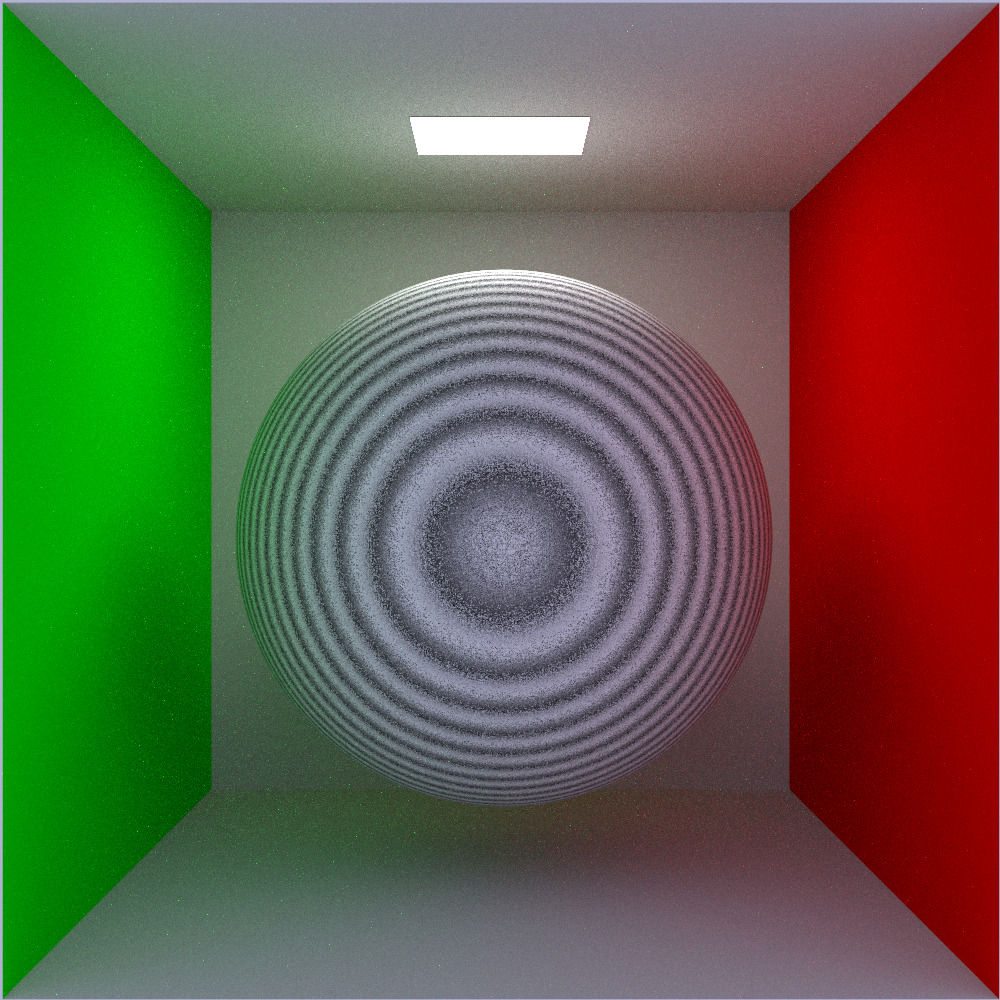

# Render examples

## Must

### Sphere

### Plane

### Translation

### Ambient Light

## Should

### Limited Cylinder

### Limited Cone

### Rotation

### Drop Shadow

## Could (Primitives)

### Unlimited Cylinder

### Unlimited Cone

### Torus (mathematically)

### Torus (OBJ)

### Triangles

### OBJ files

### Fractals

### Möbius Strip

### Tangle Cube

## Could (Transformations)

### Scale

### Shear

## Could (Lights)

### Multiple Directional Light

### Multiple Point Light

#### Separated

#### Separated Denoised

### Colored Light

### Phong Reflection Model

#### Advanced & Denoised

<!---
#### Advanced, Denoised & Upscaled

--->

## Could (Materials)

### Transparency

<!---
#### Upscaled

--->

### Refraction

### Reflection

### Texturing from file

### Texturing from procedural generation of chessboard

### Texturing from procedural generation of perlin

## Normal Mapping

#### Without Normal Mapping

#### With Normal Mapping and Texture

<!---
#### With Normal Mapping, Texture & Upscaled

--->

#### With Normal Mapping and colors

## Bonus

### Cylinder Cone

<!---
#### Upscaled

--->

### Mask

#### Mask Denoised

### Flo Box

